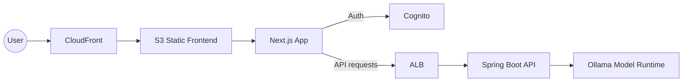

# AI Assistant: Ollama + Java + React + Terraform on AWS

This repository publishes a complete, open-source setup for a chat AI agent on AWS.

It combines:
- Ollama model runtime
- Spring Boot backend (Java)
- Next.js frontend (React + TypeScript)
- Terraform infrastructure modules and GitHub Actions deployment

[](https://github.com/hashan-silva/ai-assistant/actions/workflows/github-code-scanning/codeql)
[](https://github.com/hashan-silva/ai-assistant/actions/workflows/terraform-deployment.yml)
[](https://github.com/hashan-silva/ai-assistant/actions/workflows/frontend-lint.yml)
[](https://github.com/hashan-silva/ai-assistant/actions/workflows/sonarcloud.yml)
[](https://github.com/hashan-silva/ai-assistant/actions/workflows/terraform-ci.yml)

## Architecture

- Frontend static app hosted on S3 + CloudFront
- Backend + Ollama on ECS Fargate
- ALB for backend public API
- Cognito for authentication
- Terraform manages AWS resources end-to-end



## Project layout

```text
backend/    # Spring Boot API and AI orchestration
frontend/   # Next.js chat app
terraform/  # AWS infrastructure as code
```

## Local development

```bash
cd backend && mvn spring-boot:run
```

```bash
cd frontend && npm install && npm run dev
```

```bash
docker compose up --build
```

## Deploy to AWS

Deployments are CI-driven via GitHub Actions.

Workflow `.github/workflows/terraform-deployment.yml`:
- builds backend/frontend images
- runs `terraform apply`
- reads Terraform outputs (ALB, Cognito, frontend distribution targets)
- builds frontend with runtime env values
- syncs frontend assets to S3 and invalidates CloudFront

Default AWS region is Stockholm: `eu-north-1`.

## Required GitHub secrets

- `DOCKERHUB_USERNAME`
- `DOCKERHUB_TOKEN`
- `TF_API_TOKEN`
- `AWS_ACCESS_KEY_ID`
- `AWS_SECRET_ACCESS_KEY`

Optional:
- `AWS_REGION` (defaults to `eu-north-1`)
- `AWS_OLLAMA_IMAGE` (defaults to `ollama/ollama:latest`)
- `SONAR_TOKEN`
- `TOKEN_CICD`
